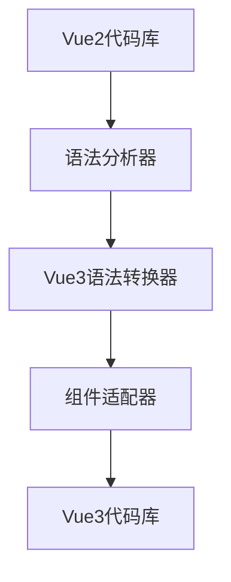
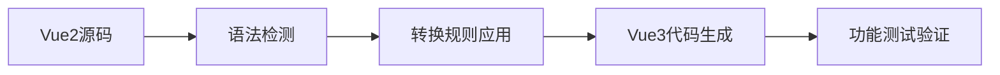

## Product Overview

修复Vue2/Vue3混合使用问题的迁移项目，解决编译错误并确保代码一致性

## Core Features

- 将main.js从Vue2语法迁移到Vue3语法
- 更新组件注册方式适配Vue3
- 修复Vue2/Vue3混合使用的编译错误
- 确保所有组件正确适配Vue3规范
- 验证迁移后项目的正常运行

## Tech Stack

- 前端框架: Vue 3
- 构建工具: Vite/Webpack (基于现有项目配置)
- 迁移目标: 从Vue 2.x语法完全迁移到Vue 3.x语法
- 组件库: 保持现有组件库但需适配Vue3

## Architecture Design

### System Architecture

采用直接迁移架构，保持现有项目结构，仅更新Vue相关语法：



### Module Division

- **核心迁移模块**: 负责main.js和入口文件的转换
- **组件适配模块**: 处理Vue2组件到Vue3的语法转换
- **依赖更新模块**: 更新Vue相关依赖包版本
- **测试验证模块**: 确保迁移后功能正常

### Data Flow



## Implementation Details

### Core Directory Structure

```
project-root/
├── src/
│   ├── main.js (需要迁移)
│   ├── App.vue
│   ├── components/ (组件需要适配)
│   ├── pages/ (页面需要适配)
│   └── utils/ (工具函数可能需要更新)
├── package.json (依赖更新)
├── vite.config.js / webpack.config.js
└── manifest.json (vueVersion: "3")
```

### Key Code Structures

#### Vue2 到 Vue3 主要转换点:

```javascript
// Vue2 语法 (需要替换)
import Vue from 'vue'
import App from './App.vue'

new Vue({
  render: h => h(App)
}).$mount('#app')

// Vue3 语法 (目标)
import { createApp } from 'vue'
import App from './App.vue'

const app = createApp(App)
app.mount('#app')
```

### Technical Implementation Plan

1. **问题识别**: 扫描所有Vue2特定语法和API调用
2. **语法转换**: 系统性替换Vue2语法为Vue3等价语法
3. **组件更新**: 更新组件的export方式和生命周期钩子
4. **依赖管理**: 更新package.json中的Vue相关依赖
5. **测试验证**: 逐一验证迁移后的功能完整性

### Integration Points

- **构建系统集成**: 确保构建工具支持Vue3语法
- **组件库兼容**: 检查第三方组件库的Vue3支持
- **API兼容**: 确保现有API调用与Vue3兼容

## 设计方案

专注于代码迁移，不涉及UI设计变更。保持现有用户界面不变，仅更新底层Vue框架版本和语法结构。

## 迁移策略

采用渐进式迁移方法，优先解决核心入口文件，然后逐步迁移各个组件，确保每个步骤都有明确的验证点。

## Agent Extensions

### SubAgent

- **code-explorer**
- Purpose: 深度搜索和分析项目中的Vue2语法使用情况
- Expected outcome: 全面识别需要迁移的文件和具体的Vue2语法位置