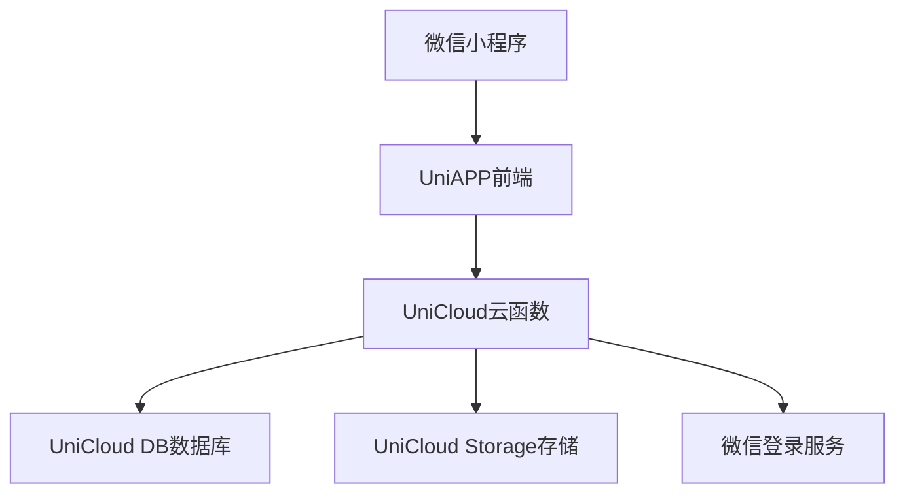
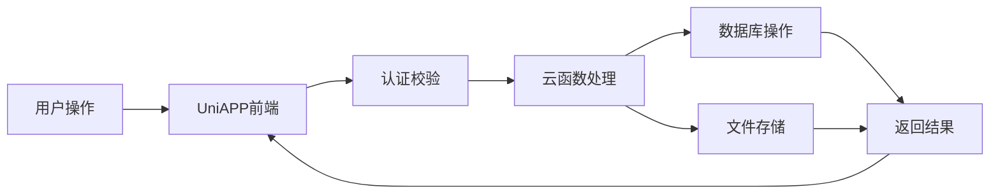

## Product Overview

基于UniAPP的校园社交系统，实现校园内的社交互动平台，支持用户发布图文动态、浏览他人内容、点赞评论等核心社交功能。

## Core Features

- 微信登录+手机号绑定认证系统
- 图文动态发布功能（支持图片上传和文字描述）
- 动态信息流浏览（时间轴展示）
- 点赞和评论互动功能
- 用户个人资料管理
- 动态搜索和分类浏览

## Tech Stack

- 前端框架：UniAPP（Vue3 + TypeScript）
- 后端服务：UniCloud（阿里云版）
- 数据库：UniCloud DB（MongoDB）
- 云存储：UniCloud Storage（图片存储）
- 认证服务：UniCloud Auth + 微信小程序登录
- UI组件库：uView UI
- 状态管理：Pinia
- HTTP请求：UniCloud客户端SDK

### System Architecture

### Module Division

- **认证模块**：微信登录、手机号绑定、用户会话管理
- **动态模块**：发布、编辑、删除动态，图片上传处理
- **互动模块**：点赞、评论、回复功能
- **用户模块**：个人资料管理、关注系统
- **信息流模块**：动态列表、分页加载、搜索功能

### Data Flow

## Design Style

采用现代化社交应用设计风格，结合校园文化元素，打造年轻化、活力十足的界面体验。以卡片式布局为主，配合流畅的动画过渡效果，营造舒适的浏览体验。

## Page Planning

1. **登录绑定页**：微信授权登录和手机号绑定流程
2. **首页动态流**：展示用户关注的动态内容，支持下拉刷新和上拉加载
3. **发布动态页**：图文编辑器，支持多图上传和文字输入
4. **动态详情页**：展示单条动态内容及评论列表
5. **个人中心页**：用户资料、我的动态、设置等

## Block Design

### 登录绑定页

- 顶部品牌标识和欢迎语
- 中间微信登录按钮（授权获取用户信息）
- 底部手机号绑定表单
- 用户协议和隐私政策链接

### 首页动态流

- 顶部搜索栏和分类标签
- 动态卡片列表（用户头像、昵称、发布时间、内容）
- 底部导航栏（首页、发布、消息、我的）
- 下拉刷新动画效果

### 发布动态页

- 顶部文字输入区域
- 中间图片上传区域（支持多图）
- 底部发布按钮和选项设置
- 表情选择器

### 动态详情页

- 顶部返回栏和分享按钮
- 动态内容展示区
- 点赞评论互动区
- 评论输入框

### 个人中心页

- 用户信息头部（头像、昵称、简介）
- 功能入口列表
- 我的动态预览
- 设置选项

## Agent Extensions

### SubAgent

- **code-explorer**
- Purpose: 探索和分析现有项目代码结构，了解项目现状
- Expected outcome: 获取项目目录结构和现有代码，为新功能开发提供基础