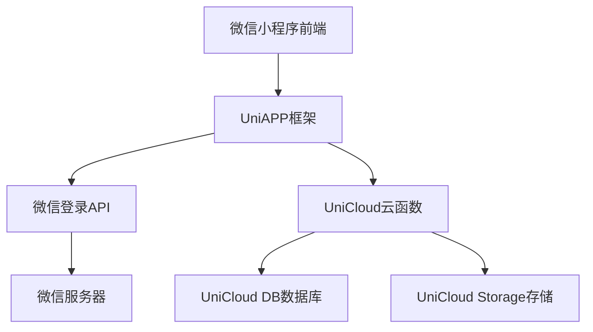
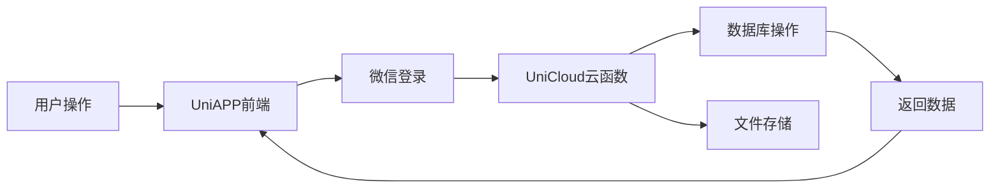

## Product Overview

基于UniAPP的校园社交系统，采用粗野主义手绘风格UI设计，提供图文动态发布、浏览和互动功能。

## Core Features

- 微信登录+手机号绑定认证
- 图文动态发布（文字+图片）
- 动态信息流浏览
- 点赞、评论互动功能
- 粗野主义手绘风格UI界面

## Tech Stack

- 前端框架：UniAPP (Vue.js)
- 后端服务：UniCloud
- 数据库：UniCloud DB
- 认证：微信小程序登录 + 手机号验证
- 存储服务：UniCloud Storage (图片存储)
- UI样式：自定义CSS + 手绘风格设计系统

## System Architecture

## Module Division

- **认证模块**：微信登录、手机号绑定、用户信息管理
- **动态模块**：发布动态、上传图片、动态列表、动态详情
- **互动模块**：点赞功能、评论功能、用户互动
- **UI组件模块**：粗野主义风格组件库

## Data Flow

## Design Style

采用粗野主义手绘风格(Brutalist Hand-drawn)，强调原始、粗犷的视觉效果。UI元素具有手绘感，包含不规则旋转、粗黑边框和强烈阴影效果。整体风格大胆、直接，充满艺术感和个性。

## Page Planning

- **首页**：动态信息流展示，顶部导航栏，底部导航菜单
- **发布页**：图文动态发布界面，包含文字输入区和图片上传
- **个人中心**：用户信息展示，个人动态列表，设置选项
- **登录页**：微信登录引导界面，手机号绑定表单

## Agent Extensions

### SubAgent

- **code-explorer** (from <subagent>)
- Purpose: 搜索和分析UniAPP项目代码结构，了解现有文件组织
- Expected outcome: 获取项目完整文件结构，确定开发起点