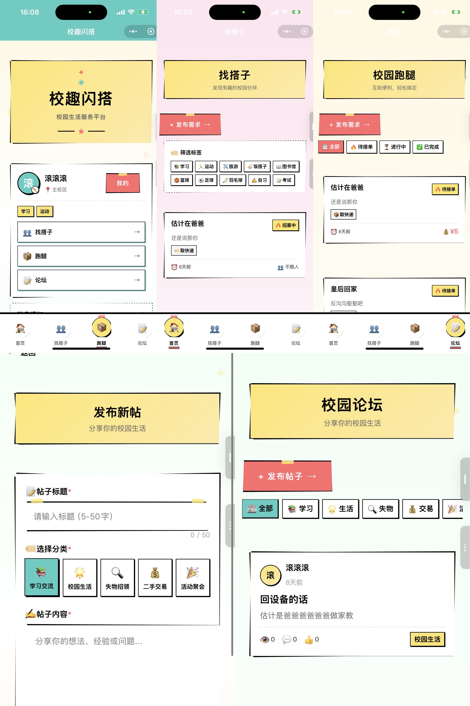

# 校趣闪搭校园服务平台

前端预览：


## 项目概述

校趣闪搭是一个为校园学生提供全方位服务的平台，包括：

- **找搭子**：寻找学习伙伴、运动搭档
- **外卖跑腿**：代取快递、食堂带饭
- **云打印**：文件上传、就近打印
- **实时消息**：站内沟通、通知提醒

## 技术栈

### 前端技术

- **框架**: UniAppX (支持多端发布)
- **语言**: UTS (UniApp TypeScript) + Vue 3 Composition API
- **状态管理**: Pinia
- **UI设计**: Brutalist 手绘风格（粗黑边框、不规则线条、大胆色块）

### 后端技术

- **云服务**: UniCloud (阿里云/腾讯云)
- **数据库**: UniCloud DB (NoSQL 文档型数据库)
- **认证**: uni-id (统一用户认证)
- **支付**: uni-pay (微信支付集成)

### 核心特性

- ✅ **UTS 类型安全**：所有组件使用 `<script setup lang="uts">` 强制类型检查
- ✅ **Brutalist UI 一致性**：通过统一组件库确保界面一致性
- ✅ **支付闭环**：完整的沙箱环境支付流程

## 项目结构

```
E:\codeplace\test\
├── components/           # 组件目录
│   └── brutalist/        # Brutalist 手绘风格组件
│       ├── BrutalistCard.vue
│       ├── BrutalistButton.vue
│       ├── BrutalistInput.vue
│       ├── HandDrawnIcon.vue
│       └── TabBar.vue
├── pages/               # 页面目录
│   ├── index/           # 首页
│   ├── buddy/           # 找搭子
│   ├── delivery/         # 外卖跑腿
│   ├── print/            # 云打印
│   ├── payment/          # 支付页面
│   └── chat/             # 聊天页面
├── stores/              # Pinia 状态管理
│   └── user.uts         # 用户状态
├── uniCloud/            # UniCloud 云端代码
│   ├── cloudfunctions/  # 云函数
│   │   ├── uni-id-cf/   # uni-id 认证云函数
│   │   └── createPayment/ # 支付云函数
│   ├── database/        # 数据库
│   │   └── schema/      # 数据库 Schema
│   └── uni-config.json  # UniCloud 配置
├── static/              # 静态资源
├── App.vue              # 应用入口
├── main.ts              # 主入口文件
├── pages.json           # 页面配置
├── manifest.json        # 应用配置
└── package.json         # 项目依赖

```

## 数据库设计

### users 集合（用户信息）

```typescript
interface User {
  _id: string
  uid: string              // uni-id 关联 ID
  nickname: string         // 用户昵称
  avatar: string           // 用户头像
  campus: string           // 所属校区
  tags: string[]           // 用户标签
  createTime: Timestamp
  updateTime: Timestamp
}
```

### requests 集合（需求请求）

```typescript
interface Request {
  _id: string
  type: 'buddy' | 'delivery' | 'carpool' | 'print' | 'secondhand'
  title: string            // 请求标题
  description: string      // 详细描述
  location?: GeoPoint      // 地理位置
  time?: Timestamp        // 约定时间
  maxParticipants?: number // 最大参与人数
  status: 'open' | 'filled' | 'completed'
  tags: string[]          // 标签列表
  creator: string         // 创建者 ID
  createTime: Timestamp
  updateTime: Timestamp
}
```

### orders 集合（订单）

```typescript
interface Order {
  _id: string
  requestId: string       // 关联请求 ID
  amount: number          // 订单金额
  status: 'unpaid' | 'paid' | 'refunded'
  paymentTime?: Timestamp
  createTime: Timestamp
  updateTime: Timestamp
}
```

### messages 集合（消息）

```typescript
interface Message {
  _id: string
  content: string         // 消息内容
  sender: string          // 发送者 ID
  receiver: string        // 接收者 ID
  timestamp: Timestamp    // 发送时间
  read: boolean           // 是否已读
}
```

## 快速开始

### 环境要求

- Node.js >= 16.x
- HBuilderX (推荐最新版本)
- 微信开发者工具
- 微信支付商户号（用于支付功能）

### 安装步骤

1. **克隆项目**

```bash
git clone <repository-url>
cd campus-quick-match
```

2. **安装依赖**

```bash
npm install
```

3. **配置 UniCloud**

- 在 HBuilderX 中打开项目
- 右键 `uniCloud` 目录 → "关联云服务空间"
- 选择或创建阿里云/腾讯云服务空间

4. **配置微信小程序**

- 修改 `manifest.json` 中的 `appid`
- 配置 `uniCloud/uni-config.json` 中的微信 AppID 和 AppSecret
- 在微信公众平台配置服务器域名

5. **运行项目**

```bash
# 开发模式（运行到微信小程序）
npm run dev:mp-weixin

# 生产构建
npm run build:mp-weixin
```

### 环境变量配置

#### 1. 微信小程序配置

在 `manifest.json` 中配置微信小程序 AppID：

```json
"mp-weixin": {
  "appid": "你的微信小程序AppID",
  "setting": {
    "urlCheck": false,
    "es6": true,
    "postcss": true,
    "minified": true,
    "enhance": false,
    "ignoreUploadUnusedFiles": true
  },
  "permission": {
    "scope.userLocation": {
      "desc": "您的位置信息将用于展示附近的服务和匹配"
    }
  },
  "requiredPrivateInfos": ["getLocation", "chooseLocation"]
}
```

#### 2. UniCloud 配置

在 `uniCloud-aliyun/uni-config.json` 中配置：

```json
{
  "mp-weixin": {
    "oauth": {
      "weixin": {
        "appid": "YOUR_WECHAT_APPID",
        "appsecret": "YOUR_WECHAT_APPSECRET"
      }
    },
    "oauthWeixin": {
      "appid": "YOUR_WECHAT_APPID",
      "appsecret": "YOUR_WECHAT_APPSECRET"
    }
  }
}
```

#### 3. uni-id 配置

在 `uniCloud-aliyun/uni-id.config.json` 中配置：

```json
{
  "tokenSecret": "${UNI_ID_TOKEN_SECRET}",
  "oauth": {
    "weixin": {
      "appid": "${WECHAT_APPID}",
      "secret": "${WECHAT_SECRET}"
    }
  },
  "tokenExpiresIn": 7200,
  "tokenExpiresThreshold": 3600,
  "passwordStrength": "medium"
}
```

**注意**: 在 UniCloud Web 控制台设置环境变量：
- `UNI_ID_TOKEN_SECRET`: 自定义的 token 密钥（建议使用随机字符串）
- `WECHAT_APPID`: 微信小程序 AppID
- `WECHAT_SECRET`: 微信小程序 AppSecret

## 核心功能实现

### 1. 用户认证（uni-id）

- 使用 uni-id 统一认证体系
- 支持微信小程序登录
- 云函数：`uni-id-cf`

### 2. 找搭子模块

- 标签匹配算法：根据用户标签和需求标签进行匹配
- 地理位置过滤：使用 GeoPoint 进行位置查询
- 状态管理：open → filled → completed

### 3. 外卖跑腿模块

- 状态机管理：open → in_progress → completed
- 防重复提交机制
- 订单状态同步

### 4. 云打印模块

- 文件上传至 UniCloud 云存储
- 打印参数校验（双面/彩印）
- 价格计算逻辑

### 5. 支付系统（uni-pay）

- 微信支付集成
- 支付回调处理
- 交易状态同步

### 6. 实时消息系统

- 使用 UniCloud 消息队列
- 未读消息计数
- 实时消息推送

## Brutalist UI 设计规范

### 颜色方案

```scss
$black: #000;
$white: #fff;
--uni-color-primary: #4CAF50; // 绿色主题
```

### 组件样式示例

```scss
.brutalist-card {
  border: 4rpx solid $black;
  clip-path: polygon(2% 0%, 98% 1%, 100% 98%, 1% 100%);
  background: $white;
  box-shadow: 8rpx 8rpx 0 var(--uni-color-primary);
  padding: 32rpx;
}
```

### 手绘图标

- 使用内联 SVG
- 关键属性：`stroke-width="1.5" vector-effect="non-scaling-stroke"`
- 不规则路径模拟手绘效果

## 开发规范

### UTS 类型安全

所有组件必须使用 `<script setup lang="uts">`：

```vue
<script setup lang="uts">
interface Props {
  title: string
}

const props = defineProps<Props>()
</script>
```

### 组件命名

- 页面组件：PascalCase（如 `BuddyList.vue`）
- 功能组件：Brutalist 前缀（如 `BrutalistCard.vue`）

### 代码风格

- 使用 Composition API
- 优先使用 `ref`、`computed`、`watch`
- 事件处理使用 `emit` 定义

## 部署流程

### 1. 微信小程序配置

#### 1.1 注册微信小程序

1. 访问 [微信公众平台](https://mp.weixin.qq.com/)
2. 注册小程序账号（选择"小程序"类型）
3. 完成认证（个人或企业）
4. 获取 AppID 和 AppSecret

#### 1.2 配置服务器域名

在微信小程序后台配置以下服务器域名：

- **request 合法域名**: 你的 UniCloud 服务空间域名
- **uploadFile 合法域名**: 你的 UniCloud 云存储域名
- **downloadFile 合法域名**: 你的 UniCloud 云存储域名

### 2. 微信支付配置

#### 2.1 申请微信支付

1. 在微信小程序后台开通微信支付功能
2. 获取商户号（MCH_ID）
3. 获取 API 密钥（API_KEY）
4. 配置支付回调地址（UniCloud 云函数地址）

#### 2.2 配置 uni-pay

在 UniCloud Web 控制台配置支付参数：

1. 进入"云函数" → "云函数配置"
2. 添加以下环境变量：
   - `WX_PAY_MCH_ID`: 微信支付商户号
   - `WX_PAY_KEY`: 微信支付 API 密钥
   - `WX_PAY_NOTIFY_URL`: 支付回调地址

### 3. UniCloud 部署

#### 3.1 关联云服务空间

1. 在 HBuilderX 中打开项目
2. 右键 `uniCloud-aliyun` 目录 → "关联云服务空间"
3. 选择或创建阿里云服务空间

#### 3.2 上传云函数

1. 右键 `uniCloud-aliyun/cloudfunctions/uni-id-cf` → "上传部署"
2. 右键 `uniCloud-aliyun/cloudfunctions/createPayment` → "上传部署"

#### 3.3 初始化数据库

1. 登录 UniCloud Web 控制台
2. 进入"云数据库" → "数据表"
3. 创建以下数据表：
   - `users`（用户信息）
   - `requests`（需求请求）
   - `orders`（订单）
   - `messages`（消息）
   - `posts`（论坛帖子）
4. 为每个数据表导入对应的 schema 文件

### 4. 本地开发

```bash
# 安装依赖
npm install

# 开发模式（运行到微信小程序）
npm run dev:mp-weixin
```

### 5. 发布小程序

```bash
# 1. 构建生产版本
npm run build:mp-weixin

# 2. 在微信开发者工具中
#    - 打开生成的 dist/dev/mp-weixin 目录
#    - 预览测试
#    - 上传代码
#    - 在微信公众平台提交审核
```

## 测试

### 沙箱环境测试

在微信开发者工具中进行：

- 用户登录流程
- 发布需求功能
- 支付流程（使用测试账号）
- 消息收发

### 关键验证点

- ✅ UTS 类型安全：所有组件通过类型检查
- ✅ UI 一致性：所有页面使用 Brutalist 组件
- ✅ 支付闭环：完成沙箱环境支付全流程

## 易错要点说明

### 1. 微信小程序配置

#### 1.1 AppID 配置错误
**问题**: 小程序无法正常启动或登录失败

**解决方案**:
- 确保 `manifest.json` 中的 `mp-weixin.appid` 与微信小程序后台一致
- 确保 `uni-config.json` 中的 `appid` 和 `appsecret` 正确
- 不要将 AppSecret 提交到代码仓库，使用环境变量

#### 1.2 域名配置问题
**问题**: 网络请求失败

**解决方案**:
- 在微信小程序后台配置所有必需的服务器域名
- 确保域名已备案
- 开发阶段可在 `manifest.json` 中设置 `"urlCheck": false`

#### 1.3 权限配置问题
**问题**: 无法获取用户位置信息

**解决方案**:
- 在 `manifest.json` 中配置 `permission.scope.userLocation`
- 添加 `requiredPrivateInfos: ["getLocation", "chooseLocation"]`
- 在代码中正确处理用户授权

### 2. 微信支付配置

#### 2.1 支付参数配置错误
**问题**: 支付创建失败

**解决方案**:
- 确保商户号（MCH_ID）正确
- 确保 API 密钥（API_KEY）正确
- 检查支付回调地址是否可访问
- 确保订单金额格式正确（单位为分）

#### 2.2 支付回调处理失败
**问题**: 支付成功但订单状态未更新

**解决方案**:
- 确保云函数 `createPayment` 正确处理回调
- 检查订单状态更新逻辑
- 添加日志记录便于排查问题

### 3. UniCloud 配置

#### 3.1 环境变量未设置
**问题**: 云函数调用失败

**解决方案**:
- 在 UniCloud Web 控制台设置所有必需的环境变量
- 确保 `UNI_ID_TOKEN_SECRET` 已设置
- 确保 `WECHAT_APPID` 和 `WECHAT_SECRET` 已设置

#### 3.2 数据库权限问题
**问题**: 数据库操作失败

**解决方案**:
- 检查数据库 Schema 的权限配置
- 确保用户有相应的读写权限
- 开发阶段可临时放宽权限限制

#### 3.3 云函数未上传
**问题**: 云函数调用失败

**解决方案**:
- 确保所有云函数已上传部署
- 检查云函数日志确认是否正常运行

### 4. 开发环境问题

#### 4.1 依赖安装失败
**问题**: npm install 失败

**解决方案**:
- 清除 node_modules 和 package-lock.json
- 使用淘宝镜像: `npm config set registry https://registry.npmmirror.com`
- 检查 Node.js 版本是否符合要求

#### 4.2 编译错误
**问题**: 项目无法编译

**解决方案**:
- 清除 unpackage 目录
- 重新安装依赖
- 检查 HBuilderX 版本是否最新

### 5. 调试技巧

#### 5.1 查看云函数日志

1. 登录 UniCloud Web 控制台
2. 进入"云函数" → "日志"
3. 选择对应的云函数查看日志

#### 5.2 本地调试

- 使用微信开发者工具的调试功能
- 在 HBuilderX 中查看控制台输出
- 使用 `console.log` 输出调试信息

#### 5.3 网络请求调试

- 在微信开发者工具的"网络"面板查看请求详情
- 检查请求参数和响应数据
- 确保请求头和请求方法正确

## 常见问题

### 1. 云函数调用失败

检查：

- 云函数是否已上传
- 服务空间是否关联
- 权限配置是否正确
- 环境变量是否已设置

### 2. 数据库操作失败

检查：

- Schema 是否已创建
- 权限规则是否正确
- 数据格式是否匹配

### 3. 支付失败

检查：

- uni-pay 配置是否正确
- 商户号配置是否正确
- 回调 URL 是否可访问
- 订单金额格式是否正确

## 贡献指南

1. Fork 本仓库
2. 创建特性分支 (`git checkout -b feature/AmazingFeature`)
3. 提交更改 (`git commit -m 'Add some AmazingFeature'`)
4. 推送到分支 (`git push origin feature/AmazingFeature`)
5. 开启 Pull Request

## 许可证

本项目采用 MIT 许可证

## 联系方式

- 项目地址：[GitHub Repository]
- 问题反馈：[Issues]

---

**注意**: 本项目为校园服务平台，请在使用前仔细阅读相关法律法规。
