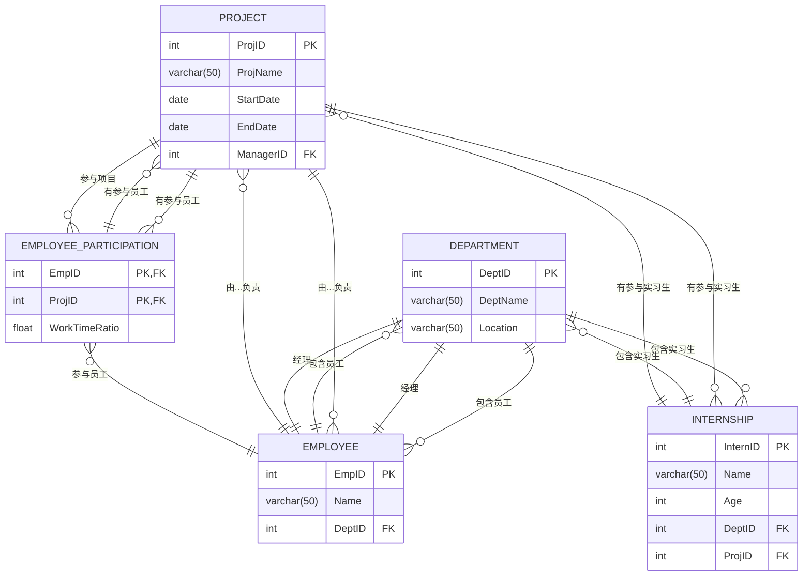
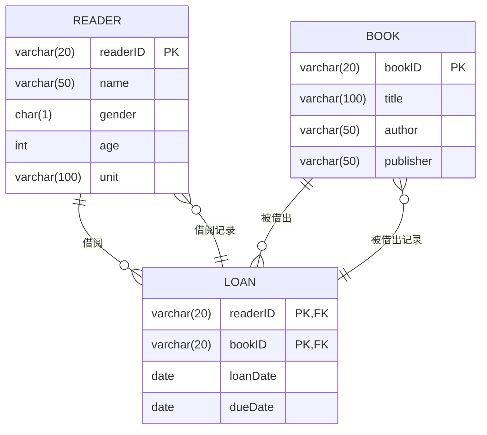

我想开发一款名为“校趣闪搭”校园找搭子、拼饭、拼车、二手闲置物品交易、云打印、论坛聊天室一体的综合平台app 或微信小程序，要有完整的支付订单功能和管理后台，ui要求类似motherduck和claude的新型粗野主义手绘极简风格，请合理布局排版美化。请为我生成vibe coding或spec coding的ai编程提示词，采用微信云开发。可以先为我开发原型。

校趣闪搭 - 校园综合服务平台

技术栈：微信小程序 + 微信云开发（云函数、云数据库、云存储）

UI 风格：粗野主义手绘极简风格（Brutalist + Hand-drawn），参考 MotherDuck/Claude 设计语言
粗黑边框、不规则手绘线条
大胆的色块分割
简洁的排版、充足的留白
手绘图标和涂鸦元素
黑白为主，品牌色点缀

核心功能模块：

找搭子 - 发布/浏览找搭子需求（学习、运动、旅游等），标签匹配
拼饭拼车 - 实时拼单功能，位置选择，时间预约，人数管理
二手市场 - 商品发布/浏览，分类筛选，图片上传，聊天议价
云打印 - 文件上传，打印店选择，规格设置（单双面/彩印），下单支付
论坛聊天室 - 话题广场，实时聊天，帖子发布，点赞评论
订单支付系统 - 微信支付接口，订单列表，交易记录，退款处理
管理后台 - 用户管理，内容审核，订单管理，数据统计，财务对账

数据库设计：users, posts, orders, products, chats, notifications

必需功能：微信登录授权、实时消息推送、图片云存储、地理位置、支付回调、内容安全审核

请生成完整的微信小程序代码框架，包含前端页面、云函数、数据库 schema 和管理后台。

---

您可以将这个提示词提供给任何 AI 编程助手使用。需要我直接为您开发 Web 版演示原型吗？

SupaBase

请严格根据"E:\NJTS-Codeprojects-2023\WechatMiniproject\SupabaseSchoolAPP\校趣闪搭gemini3"项目中的前端原型，分析所有的核心功能并计划实现，为我生成可直接预览的web系统、以及微信小程序。要调用MCP工具如supabase、vercel、figma等，选择合适的技术栈，构建后端和数据库，制订符合规范的SPEC并开始构建，要求系统完整实现、流畅无bug。

TCB

请严格根据"E:\NJTS-Codeprojects-2023\WechatMiniproject\SupabaseSchoolAPP\SchoolBuzzgemini3TCB"项目中的前端原型，分析所有的核心功能并计划实现，为我生成可直接预览的web应用和微信小程序。要求从云开发、云托管、函数型云托管中选择合适的技术栈，要调用MCP工具，如figma等，构建后端和数据库，制订符合规范的SPEC并开始构建，要求系统完整实现、流畅无bug。

Start-Process powershell -Verb runAs

基于前端原型分析所有核心功能并制定uniapp实现方案，创建可直接预览的uniapp应用。需完成以下工作： 1. 技术迁移与实现 - 将React原型转换为uniapp框架 - 实现粗野主义手绘极简UI风格：  * 粗黑边框+不规则手绘线条  * 大胆色块分割布局  * 手绘图标/涂鸦元素（黑白主色+品牌色点缀）  * 简洁排版与充分留白 2. 云端架构设计 - 选择cloudbase云开发/云托管/函数型云托管技术栈 - 使用MCP工具构建：  * 符合规范的API SPEC  * 后端服务架构  * 数据库设计方案 3. 质量要求 - 完整实现所有功能模块 - 确保系统无性能瓶颈 - 严格测试保证零bug - 保持MotherDuck/Claude设计语言一致性 4. 交付物 - 可直接部署的Uniapp应用 - 完整前后端源代码 - 数据库Schema设计文档 - 云端部署方案说明书

基于前端原型E:\NJTS-Codeprojects-2023\WechatMiniproject\SupabaseSchoolAPP\SchoolBuzzGemini3TCBUniapp\校趣闪搭gemini3，制定完整的Uniapp实现方案并创建可预览应用。具体要求如下：

1. 技术实现
- 将React原型完整迁移至Uniapp框架
- 实现粗野主义UI风格：
  * 采用粗黑边框与不规则手绘线条
  * 使用大胆色块进行布局分割
  * 设计手绘风格图标/涂鸦元素（黑白主色+品牌色点缀）
  * 保持简洁排版与充分留白

2. 云端架构
- 采用CloudBase云开发技术栈
- 使用MCP工具构建：
  * 标准化API规范文档
  * 可扩展的后端服务架构
  * 优化的数据库设计方案

3. 质量保障
- 100%功能实现度
- 性能优化确保流畅体验
- 严格测试流程保证稳定性
- 保持MotherDuck/Claude设计语言统一性

4. 交付内容
- 可立即部署的Uniapp应用包
- 完整的前后端源代码
- 数据库Schema设计文档
- 云端部署详细方案说明书

我想利用HbuilderX+Uniapp +Unicloud云开发用AI编程构建一个外卖快递跑腿、云打印、二手交易平台、校园论坛一体化校园服务平台微信小程序。现在已经有了Gemini设计的html+typescript+react+vite前端原型，基于此原型分析所有的核心功能逐步严格实现，且选用Uniapp（Vue3+Vite）、设计unicloud数据库、实现支付和其他业务逻辑、前端界面状态管理等等。为此为我选择合适的技术栈细节，编写合适的SKILLS以及合适的mcp AI编程服务，利用Rules规则系统，严格遵循UniAPP API和微信小程序开发语法规范、为我撰写专业的AI编程提示词prompts，严格按照SPEC规范。

基于HbuilderX+Uniapp +Unicloud云开发构建一个找搭子、拼饭拼车、外卖快递跑腿、云打印、二手交易平台、校园论坛等一体化校园服务平台微信小程序。分析以下所有的核心功能逐步严格实现，且选用UniappX、设计unicloud数据库、实现支付和其他业务逻辑、前端界面状态管理等等。为此为我选择合适的技术栈细节，合理利用SKII2brutalist-handdrawn-ui和Skill1UTSandVue3CompositionAPIMastery以及Agent，严格遵循UniAPPX和微信小程序开发语法规范、按照SPEC规范创建plan并执行。
要求集成UniCloud云服务，包括但不限于云函数、uni-pay支付服务以及uni-id身份认证服务。
需严格遵循UCloud UTS UVue生态系统的语法规范
校趣闪搭 - 校园综合服务平台
技术栈： UniappX + Unicloud+微信小程序
UI 风格：时尚粗野主义手绘极简风格（Brutalist + Hand-drawn），参考 MotherDuck/Claude 设计语言
粗黑边框、不规则手绘线条
大胆的色块分割
简洁的排版、充足的留白
手绘图标和涂鸦元素
黑白为主，品牌色点缀
导航栏：合理结合底部导航和列表式导航

核心功能模块：
找搭子 - 发布/浏览找搭子需求（学习、运动、旅游、饭搭子等），标签匹配
外卖快递跑腿 - 发布/浏览跑腿需求（外卖、快递、代购、代拿等），标签匹配
拼饭拼车 - 实时拼单功能，位置选择，时间预约，人数管理，标签匹配

二手市场 - 商品发布/浏览，分类筛选，图片上传，聊天议价
云打印 - 文件上传，打印店选择，规格设置（单双面/彩印），下单支付
校园论坛 - 话题广场，实时聊天，帖子发布，点赞评论
订单支付系统 - 微信支付接口，订单列表，交易记录，退款处理

管理后台（可之后补充） - 用户管理，内容审核，订单管理，数据统计，财务对账
数据库设计
必需功能：微信登录授权、实时消息推送、图片云存储、地理位置、支付回调、内容安全审核
请逐步分析并实现以上功能模块，确保系统完整、流畅无bug。
